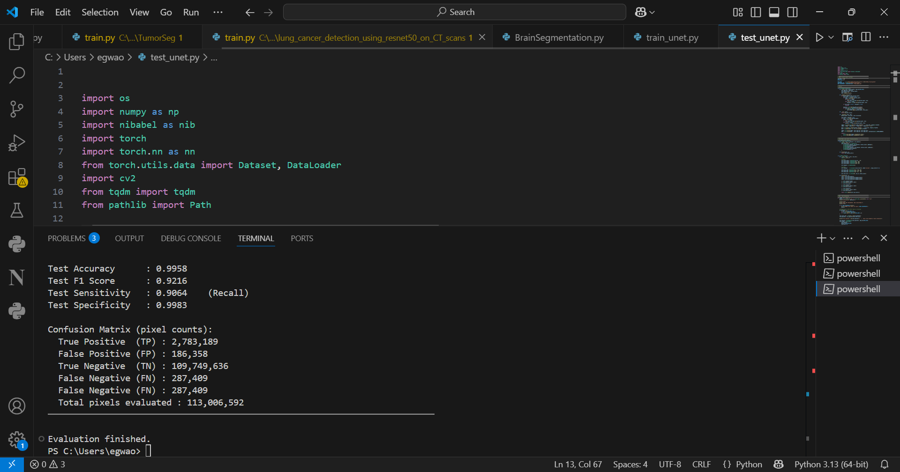
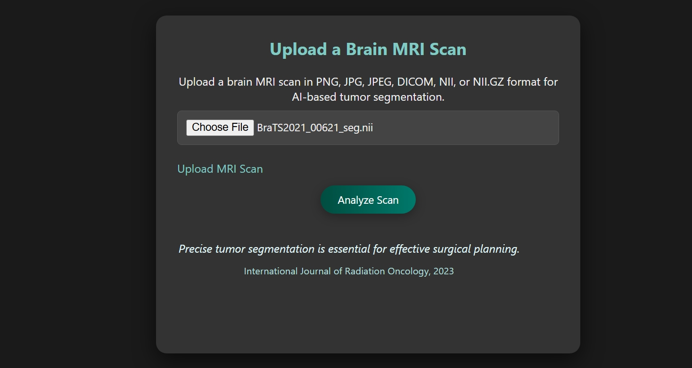

# 🧠 Brain Tumor Segmentation Using U-Net on MRI Scans


**Core Stack:** Python (PyTorch, Flask) · U-Net · Medical Image Segmentation · NIfTI · MRI

A deep learning system for automated **brain tumor segmentation** from MRI scans, achieving a **91.47% Dice Score** and **99.58% accuracy** using a U-Net architecture trained on the BraTS 2021 dataset. Deployed as a full web application with a built-in patient management dashboard supporting real hospital NIfTI file formats.

---

## 📋 Table of Contents
- [Results](#results)
- [How to Run](#how-to-run)
- [Overview](#overview)
- [Dataset](#dataset)
- [Methodology](#methodology)
- [Model Architecture](#model-architecture)
- [Training Details](#training-details)
- [Web Application](#web-application)
- [Limitations](#limitations)
- [Future Work](#future-work)
- [Disclaimer](#disclaimer)

---

## Results

Strong segmentation performance on unseen test data:

| Metric | Score |
|---|---|
| Dice Score (Primary) | **91.47%** |
| Accuracy | **99.58%** |
| F1 Score | **92.16%** |
| Sensitivity (Recall) | **90.64%** |
| Specificity | **99.83%** |



High overlap between predicted tumor regions and ground-truth masks, with excellent background classification and minimal false positives.

---

## How to Run

### Prerequisites
- Python 3.10 or higher
- Git
- A trained model checkpoint (`best_model.pth`)

### 1. Clone the repository

```bash
git clone https://github.com/egwaojeangel/deep_learning_based_brain_tumor_segmentation_using_unet.git
cd deep_learning_based_brain_tumor_segmentation_using_unet
```

### 2. Create a virtual environment

```bash
python -m venv venv

# Windows
venv\Scripts\activate

# Mac/Linux
source venv/bin/activate
```

### 3. Install dependencies

```bash
pip install -r requirements.txt
```

### 4. Add your model checkpoint

Place your trained `best_model.pth` in a `checkpoints/` folder:

```
deep_learning_based_brain_tumor_segmentation_using_unet/
├── checkpoints/
│   └── best_model.pth
├── Sample_MRI_Images/
│   ├── 00000534_brain_flair.nii
│   └── braintumor.jpg
├── brainsegapp.py
├── tumorseg.html
└── ...
```

Then open `brainsegapp.py` and confirm this line:

```python
MODEL_PATH = "checkpoints/best_model.pth"
```

### 5. Run the app

```bash
python brainsegapp.py
```

Open your browser at: **http://127.0.0.1:5000**

### Supported Scan Formats

| Format | Description |
|---|---|
| `.jpg`, `.png` | Standard brain scan images |
| `.nii`, `.nii.gz` | NIfTI format — real hospital MRI files |

### Sample Test Scans

Sample MRI images are included so you can test the app immediately without downloading any dataset:

```
Sample_MRI_Images/
├── 00000534_brain_flair.nii
└── braintumor.jpg
```

Simply upload either file in the web app to see segmentation in action.

### Demo Video

[](https://drive.google.com/file/d/1H175DdmRg-RpnKBPS9IlPN6SOq7HavQL/view?usp=drivesdk)

Click the thumbnail above to watch the full system demo.

---

## Overview

Brain tumor segmentation plays a critical role in diagnosis, treatment planning, and disease monitoring. Manual delineation by radiologists is time-consuming and subject to inter-observer variability, making automated deep learning solutions both practical and impactful.

This project goes beyond a standard model training exercise. It implements a complete end-to-end pipeline: from raw NIfTI MRI volumes through preprocessing, U-Net inference, and pixel-level segmentation and these are all deployed in a web application with a full patient records dashboard.

---

## Dataset

**BraTS 2021 (Brain Tumor Segmentation Challenge)** — a widely adopted benchmark in medical imaging research.

| Property | Detail |
|---|---|
| Source | Multi-institutional MRI scans |
| Annotations | Expert-annotated tumor segmentation masks |
| Modalities | FLAIR, T1, T1ce, T2 |
| Modality Used | FLAIR — chosen for its strong contrast of tumor-associated edema |

### Data Split (Patient-level to prevent data leakage)

| Split | Percentage |
|---|---|
| Training | 70% |
| Validation | 15% |
| Testing | 15% |

Only 2D slices containing tumor regions were selected for training and evaluation, improving class balance and segmentation relevance.

> ⚠️ Due to size and licensing restrictions, the BraTS dataset is not included in this repository.

---

## Methodology

### Image Preprocessing
- Slice extraction from 3D NIfTI volumes
- Min-max intensity normalisation
- Resizing to **96 × 96 pixels**
- Binary mask generation (tumor vs. background)
- Each slice treated as a single-channel (grayscale) input

### Data Augmentation (Training Only)
- Horizontal flipping
- Vertical flipping
- Random 90° rotations

Augmentations applied consistently to both images and masks to preserve spatial alignment.

---

## Model Architecture

**U-Net** — a convolutional neural network specifically designed for biomedical image segmentation.

**Encoder (Contracting Path)**
- Stacked double convolutional blocks
- Batch normalisation + ReLU activations
- Max-pooling for spatial downsampling

**Decoder (Expanding Path)**
- Bilinear upsampling
- Skip connections from encoder layers
- Feature concatenation for spatial detail recovery

**Output**
- 1×1 convolution
- Sigmoid activation
- Binary segmentation mask (tumor / non-tumor)

---

## Training Details

| Parameter | Value |
|---|---|
| Framework | PyTorch |
| Loss Function | Binary Cross-Entropy (BCELoss) |
| Optimizer | Adam |
| Learning Rate | 1e-3 |
| Batch Size | 4 |
| Epochs | 10 |
| Device | CPU |

### Training Stability Techniques
- Gradient clipping (max norm = 1.0)
- Mid-epoch checkpoint saving
- Automatic resume from last checkpoint
- Best-model tracking based on validation Dice score

### Checkpointing

| File | Purpose |
|---|---|
| `latest_checkpoint.pth` | Latest training state — resume from here |
| `best_model.pth` | Best model by validation Dice score |

Training can be safely resumed after interruption without loss of progress.

---

## Web Application

A Flask-based web application provides a full clinical support interface:

- Upload MRI scans in standard or NIfTI format
- Real-time tumor segmentation with red overlay highlighting
- Estimated tumor size and location
- Patient management dashboard — add, view, and manage patient records
- Scan history stored per patient

---

## Relation to Existing Research

U-Net architectures remain a dominant baseline for brain tumor segmentation. Recent studies continue to demonstrate their effectiveness on BraTS datasets when combined with careful preprocessing and evaluation (Isensee et al., 2021; Hatamizadeh et al., 2022; Zhang et al., 2023). This project implements a clean, reproducible U-Net pipeline serving as a strong baseline for future extensions.

---

## Limitations
- 2D slice-based segmentation rather than full 3D volumetric analysis
- Single MRI modality (FLAIR only)
- No clinical validation or expert radiologist review
- No explainability or uncertainty estimation
- No external dataset validation

---

## Future Work
- Extend to 3D U-Net or nnU-Net for volumetric segmentation
- Incorporate multi-modal MRI inputs (T1, T1ce, T2 + FLAIR)
- Add Dice + Focal loss combinations
- Integrate Grad-CAM explainability
- Cloud deployment (Hugging Face Spaces / Render)
- Validate with expert radiologist annotations

---

## Disclaimer

This project is intended **strictly for research and educational purposes**. It is not a certified medical device and must not be used for clinical diagnosis or treatment decisions. All outputs should be reviewed by qualified healthcare professionals.

---

## Author

**Angel Egwaoje**

Machine Learning Engineer | Computer Vision & Medical Imaging

[](https://www.linkedin.com/in/angel-egwaoje-416927280)
[](https://github.com/egwaojeangel)

